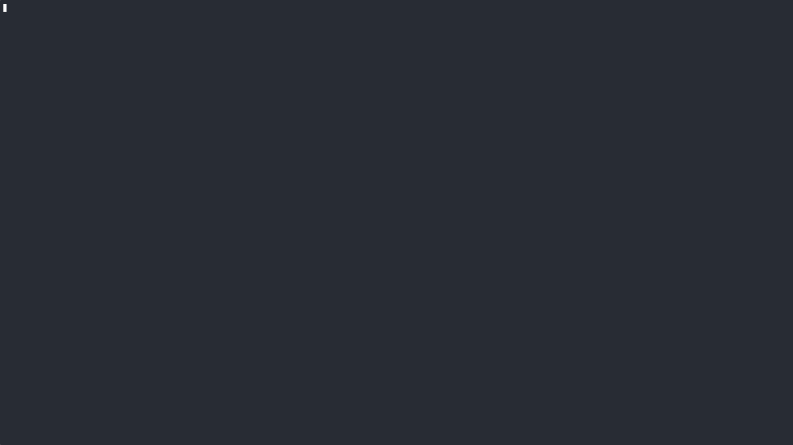

# descendit

**Where we're going, we don't need code**

Deterministic structural metrics and loss scoring for Rust code.

`descendit` parses Rust source with `syn`, extracts quantifiable structural metrics, and scores them through a pipeline inspired by ML loss functions. The same source always produces the same scores — deterministic by design.

Built for agent-driven refactoring loops: score, identify hotspots, refactor, re-score, converge.

## Install

```bash
cargo install descendit
```

Requires Rust 1.85+ (edition 2024).

## Quick start

```bash
descendit heatmap src/ --summary --top 5
```

This prints composite loss, per-dimension scores, and the top 5 hotspots.

descendit runs rust-analyzer for cross-module coupling analysis automatically.
Use `watch` mode for fast repeated analysis without cold starts.

## The refactoring loop

descendit is designed for iterative, measurable improvement — like gradient
descent. Use `watch` to keep a persistent rust-analyzer session so repeated
analysis avoids cold starts:

```bash
# Start analysis server
descendit watch --sock /tmp/descendit.sock src/

# Epoch 0: baseline
descendit analyze src/ --sock /tmp/descendit.sock > epoch0.json

# Inspect what to fix first
descendit heatmap src/ --sock /tmp/descendit.sock --top 10

# ... refactor the top hotspot ...

# Epoch 1: measure improvement
descendit analyze src/ --sock /tmp/descendit.sock > epoch1.json
descendit diff epoch0.json epoch1.json --compliance

# Repeat until convergence (|delta| < 0.005 between epochs)

# Shut down the server when done
descendit reap --sock /tmp/descendit.sock
```

A typical convergence run:

| Epoch | Composite loss | Delta | Action |
|-------|---------------|-------|--------|
| 0 | 0.142 | — | baseline |
| 1 | 0.098 | -0.044 | split bloated function |
| 2 | 0.071 | -0.027 | extract duplicated logic |
| 3 | 0.065 | -0.006 | reduce state cardinality |
| 4 | 0.063 | -0.002 | diminishing returns, stop |

Most improvement lands in epochs 1-2. By epoch 4+, you're in diminishing returns.

## Interactive explorer

An interactive TUI flamegraph for drilling into loss attribution with
syntax-highlighted source preview:

```bash
descendit explore src/
```



[Watch the full recording on asciinema](https://asciinema.org/a/vlyBU5qMA3BkxYVb)

## Loss dimensions

Each dimension produces a score in [0, 1] where 1.0 = perfect.

| Dimension | Scope | What it measures |
|-----------|-------|-----------------|
| `duplication` | global | Fraction of functions in structural duplicate groups |
| `state_cardinality` | per-type, per-function | Geometric mean of log2 field cardinality |
| `bloat` | per-function | Function length beyond threshold (35 lines) |
| `code_economy` | global | Overhead ratio (non-test functions / public functions) |
| `coupling_density` | per-module | Cross-module call edges (via rust-analyzer) |

**Composite loss** = `1 - geometric_mean(dimension_scores)`. Range [0, 1], where 0.0 is perfect.

| Composite loss | Quality |
|---------------|---------|
| < 0.05 | Excellent |
| 0.05 - 0.15 | Good |
| 0.15 - 0.30 | Room for improvement |
| 0.30+ | Significant structural issues |

## CLI

```
$ descendit --help
Deterministic structural loss functions for Rust code

Usage: descendit [OPTIONS] <COMMAND>

Commands:
  analyze  Scan source code and produce a raw metrics snapshot
  diff     Compare two analysis snapshots and show what changed
  list     List all available loss dimensions and their descriptions
  watch    Watch paths for changes and serve analysis over a Unix socket
  reap     Shut down a running watch server
  heatmap  Drill down into which functions and types contribute most to loss
  explore  Interactive flamegraph explorer for loss drill-down
  agent    Agent-oriented utilities
  policy   Dump the default compliance policy as JSON
  help     Print this message or the help of the given subcommand(s)

Options:
      --sock <SOCK>  Connect to a running analysis server via this Unix socket path
  -h, --help         Print help
  -V, --version      Print version
```

Run `descendit <command> --help` for detailed flags, or `descendit agent guide` for
the full reference.

## Policy customization

Scoring thresholds and aggregation strategies are configurable via JSON:

```bash
descendit policy --dump-default > my-policy.json
# edit thresholds...
descendit heatmap src/ --policy my-policy.json
```

## License

Apache-2.0
